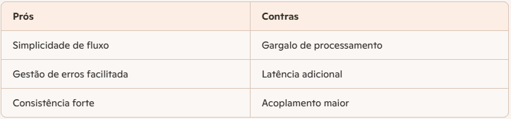

# miniguia-estudos-notebooklm
Este projeto, visa aliar pensamento crítico, curadoria de fontes e organização do conhecimento para criar um Caderno Temático no NotebookLM.

# 📘 Architectural and Software Design Patterns Catalog

## 🎯 Objetivo
Criar um guia de arquitetura de software que:
- Se baseie nos padrões de mercado e nos tipos de arquiteturas e serviços.
- Indique a(s) melhor(es) opção(es) de solução para um determinado problema apresentado.
- Sugira implementações ou explique de forma clara os padrões de arquitetura e seu melhor uso.
- Responda a dúvidas simples sobre o funcionamento de um determinado padrão.
- Compare tipos de padrões ou soluções arquitetônicas em um contexto específico.
- Apresente, diante de um problema contextualizado, a topologia de solução e os padrões/arquiteturas mais adequados.
- Liste prós e contras de cada solução.

---

## 📚 Tema Escolhido
**Architectural and Software Design Patterns Catalog**

---

## 🔎 Escopo das Fontes
As fontes exploram o universo da engenharia de software com foco em:
- **Padrões de projeto (Design Patterns)**  
  - Legado do livro clássico da *Gang of Four (GoF)*.  
  - Categorias: **Criacionais**, **Estruturais** e **Comportamentais**.
- **Antipadrões**  
  - Estratégias comuns, porém ineficazes, que devem ser evitadas para garantir a saúde do código.
- **Arquiteturas modernas**  
  - Aplicação prática em sistemas distribuídos.  
  - Ferramentas: **Kubernetes**, **Docker**.
- **Refatoração**  
  - Catálogos práticos para transformar códigos problemáticos em estruturas mais limpas e sustentáveis.

---

## 📂 Curadoria de Fontes
Foram adicionadas aproximadamente **24 fontes de dados**, incluindo:

- [Refactoring Guru - Design Patterns](https://refactoring.guru/pt-br/design-patterns)  
- [Microsoft Learn - Azure Architecture Patterns](https://learn.microsoft.com/en-us/azure/architecture/patterns/)  
- [SourceMaking - Design Patterns](https://sourcemaking.com/design_patterns)  
- [SoftDesign - Consultoria em Arquitetura de Software](https://www.softdesign.com.br/blog/desenvolvimento-ou-consultoria-em-arquitetura-de-software-como-escolher/)  
- [AWS - Service-Oriented Architecture](https://aws.amazon.com/pt/what-is/service-oriented-architecture)  

---

## ✅ Entregáveis Esperados
- Guia de padrões arquiteturais e de software.
- Comparação entre diferentes soluções arquitetônicas.
- Exemplos de topologias aplicadas a problemas específicos.
- Análise de prós e contras de cada padrão/arquitetura.
- Sugestões de implementação com base em boas práticas.


## ✅ Modelo de Estruturação de Problemas e Soluções

### 📌 Contextualização
> Eu, como especialista em soluções de TI, preciso estruturar **[detalhes do sistema/projeto]**, para entregar a(s) funcionalidade(s) **[listar funcionalidades]** com integração a **[serviços externos necessários]**.  
> Quais ferramentas poderiam ser implementadas para que o sistema funcione da melhor forma, seguindo os melhores padrões de desenvolvimento, segurança e resiliência?  
> Apresente a solução proposta graficamente e relacione os prós e contras de cada solução, caso haja mais de uma opção.

---

### 🛒 Exemplo: E-commerce com Checkout

#### Proposta de Topologia
Para uma solução de checkout de e-commerce que se integra a múltiplos serviços externos, a arquitetura de **Microsserviços** é a mais recomendada devido à sua flexibilidade e escalabilidade.  
Dentro dessa abordagem, existem duas formas principais de gerenciar transações distribuídas (como o fluxo de pagamento), cada uma com seus respectivos trade-offs.

---

#### 🔹 Opção 1: Padrão SAGA por Orquestração (Centralizado)
```text
[ Cliente/Web-App ]
       |
[ API Gateway / BFF ] ----> [ Serviço de Identidade ]
       |
[ ORQUESTRADOR DE CHECKOUT ] (Coordena o fluxo)
       |
       +---> [ Serviço de Pedidos ]
       |
       +---> [ Serviço de Pagamento ] ----> [ Adaptador Anticorrupção (ACL) ] ----> [ API Provedor Externo ]
       |
       +---> [ Serviço de Inventário ]





| **Prós** | **Contras** |
| --- | --- |
| Simplicidade de fluxo | Gargalo de processamento |
| Gestão de erros facilitada | Latência adicional |
| Consistência forte | Acoplamento maior |

#### 🔹 Opção 2: Padrão SAGA por Coreografia (Orientada a Eventos)
[ Cliente ]
    |
[ API Gateway ] 
    |
[ Serviço de Pedidos ] --(Evento: PedidoCriado)--> [ BARRAMENTO DE EVENTOS ]
                                                         |
          +----------------------------------------------+------------------------------------------+
          |                                              |                                          |
[ Serviço de Pagamento ]                       [ Serviço de Inventário ]                  [ Serviço de Notificação ]
(Consome 'PedidoCriado')                       (Consome 'PedidoCriado')                   (Consome 'PagamentoSucesso')
          |                                              |                                          |
[ Provedor Externo ]                           [ Reserva Estoque ]                        [ Envia E-mail/SMS ]


| **Prós** | **Contras** |
| --- | --- |
| Escalabilidade extrema | Complexidade de depuração |
| Resiliência por isolamento | Consistência eventual |
| Facilidade de evolução | Rollbacks complexos |


#### 🛠️ Ferramentas e Padrões Recomendados
Arquitetura Hexagonal (Portas e Adaptadores): isolamento das integrações externas.

Circuit Breaker (Disjuntor): evitar falhas em cascata.

Backends for Frontends (BFF): otimização para diferentes dispositivos.

Banco de Dados NoSQL (DynamoDB/Cosmos DB): baixa latência e alta disponibilidade.

Gerenciamento de API (Azure APIM / Amazon API Gateway): segurança e controle centralizado.


#### 📌 Recomendação Final
Orquestração (Opção 1): indicada para sistemas em fase inicial ou com lógica de checkout complexa.

Coreografia (Opção 2): indicada para sistemas de grande escala, com foco em resiliência e evolução contínua.


```Esse complemento deixa o **README.md** pronto para servir como guia prático, com modelo reutilizável para diferentes problemas e exemplos claros de aplicação.  ```
