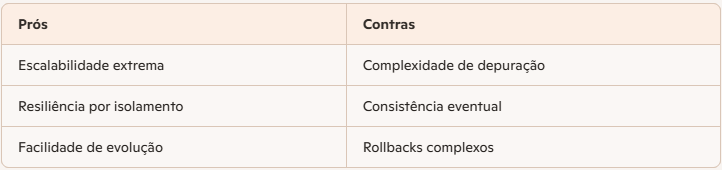

## ✅ Modelo de Estruturação de Problemas e Soluções

### 📌 Exemplo de Formato de prompt estruturado - Contextualização
> Eu, como especialista em soluções de TI, preciso estruturar **[detalhes do sistema/projeto]**, para entregar a(s) funcionalidade(s) **[listar funcionalidades]** com integração a **[serviços externos necessários]**.  
> Quais ferramentas poderiam ser implementadas para que o sistema funcione da melhor forma, seguindo os melhores padrões de desenvolvimento, segurança e resiliência?  
> Apresente a solução proposta graficamente e relacione os prós e contras de cada solução, caso haja mais de uma opção.

---

### 🛒 Exemplo: E-commerce com Checkout

#### Proposta de Topologia
Para uma solução de checkout de e-commerce que se integra a múltiplos serviços externos, a arquitetura de **Microsserviços** é a mais recomendada devido à sua flexibilidade e escalabilidade.  
Dentro dessa abordagem, existem duas formas principais de gerenciar transações distribuídas (como o fluxo de pagamento), cada uma com seus respectivos trade-offs.

---

#### 🔹 Opção 1: Padrão SAGA por Orquestração (Centralizado)
```text
[ Cliente/Web-App ]
       |
[ API Gateway / BFF ] ----> [ Serviço de Identidade ]
       |
[ ORQUESTRADOR DE CHECKOUT ] (Coordena o fluxo)
       |
       +---> [ Serviço de Pedidos ]
       |
       +---> [ Serviço de Pagamento ] ----> [ Adaptador Anticorrupção (ACL) ] ----> [ API Provedor Externo ]
       |
       +---> [ Serviço de Inventário ]

```


#### 🔹 Opção 2: Padrão SAGA por Coreografia (Orientada a Eventos)
```
[ Cliente ]
    |
[ API Gateway ] 
    |
[ Serviço de Pedidos ] --(Evento: PedidoCriado)--> [ BARRAMENTO DE EVENTOS ]
                                                         |
          +----------------------------------------------+------------------------------------------+
          |                                              |                                          |
[ Serviço de Pagamento ]                       [ Serviço de Inventário ]                  [ Serviço de Notificação ]
(Consome 'PedidoCriado')                       (Consome 'PedidoCriado')                   (Consome 'PagamentoSucesso')
          |                                              |                                          |
[ Provedor Externo ]                           [ Reserva Estoque ]                        [ Envia E-mail/SMS ]
```




#### 🛠️ Ferramentas e Padrões Recomendados
Arquitetura Hexagonal (Portas e Adaptadores): isolamento das integrações externas.

Circuit Breaker (Disjuntor): evitar falhas em cascata.

Backends for Frontends (BFF): otimização para diferentes dispositivos.

Banco de Dados NoSQL (DynamoDB/Cosmos DB): baixa latência e alta disponibilidade.

Gerenciamento de API (Azure APIM / Amazon API Gateway): segurança e controle centralizado.


#### 📌 Recomendação Final

| **Orquestração (Opção 1):** | indicada para sistemas em fase inicial ou com lógica de checkout complexa. |
|---|----|
| **Coreografia (Opção 2):**  | indicada para sistemas de grande escala, com foco em resiliência e evolução contínua. |


- [** Sugestão de apresentação em Blueprint (ppt)**] (docs/High_Performance_Checkout_Blueprint.pptx)
- [** Sugestão de apresentação em Blueprint (pdf)**] (High_Performance_Checkout_Blueprint.pdf)